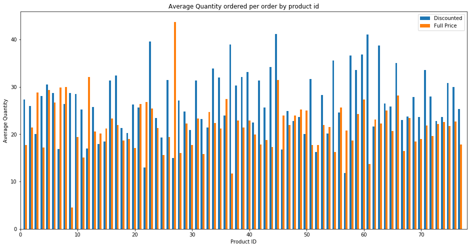
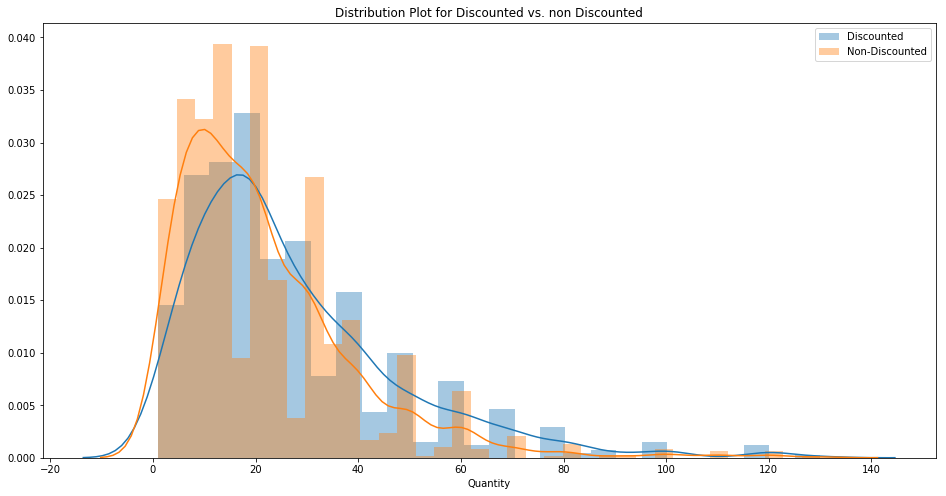
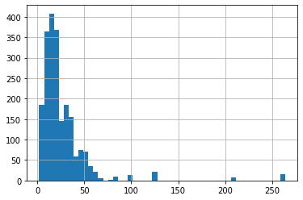
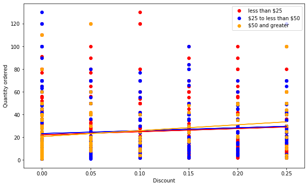
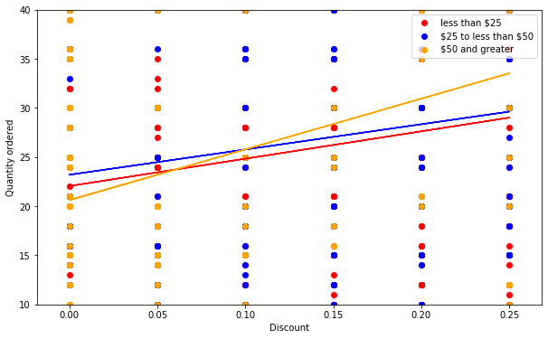

```python
# Load & query database
import sqlite3
conn = sqlite3.connect('Northwind_small.sqlite')
cur = conn.cursor()
```


```python
import pandas as pd
import numpy as np
import matplotlib.pyplot as plt
import seaborn as sns
import re
```


```python
from scipy import stats
import statsmodels.api as sm
from statsmodels.formula.api import ols
from sklearn.linear_model import LinearRegression
from sklearn.model_selection import cross_val_score
from sklearn.model_selection import KFold
```

## 1. Querying Data & Exploratory Data Analysis


```python
query = """SELECT name FROM sqlite_master WHERE type='table' ORDER BY name;"""
```


```python
query = """SELECT * FROM 'OrderDetail';"""
```


```python
cur.execute(query)
df = pd.DataFrame(cur.fetchall())
df.columns = [x[0] for x in cur.description]
df.head()
```


<div>
<style scoped>
    .dataframe tbody tr th:only-of-type {
        vertical-align: middle;
    }

    .dataframe tbody tr th {
        vertical-align: top;
    }

    .dataframe thead th {
        text-align: right;
    }
</style>
<table border="1" class="dataframe">
  <thead>
    <tr style="text-align: right;">
      <th></th>
      <th>Id</th>
      <th>OrderId</th>
      <th>ProductId</th>
      <th>UnitPrice</th>
      <th>Quantity</th>
      <th>Discount</th>
    </tr>
  </thead>
  <tbody>
    <tr>
      <th>0</th>
      <td>10248/11</td>
      <td>10248</td>
      <td>11</td>
      <td>14.0</td>
      <td>12</td>
      <td>0.0</td>
    </tr>
    <tr>
      <th>1</th>
      <td>10248/42</td>
      <td>10248</td>
      <td>42</td>
      <td>9.8</td>
      <td>10</td>
      <td>0.0</td>
    </tr>
    <tr>
      <th>2</th>
      <td>10248/72</td>
      <td>10248</td>
      <td>72</td>
      <td>34.8</td>
      <td>5</td>
      <td>0.0</td>
    </tr>
    <tr>
      <th>3</th>
      <td>10249/14</td>
      <td>10249</td>
      <td>14</td>
      <td>18.6</td>
      <td>9</td>
      <td>0.0</td>
    </tr>
    <tr>
      <th>4</th>
      <td>10249/51</td>
      <td>10249</td>
      <td>51</td>
      <td>42.4</td>
      <td>40</td>
      <td>0.0</td>
    </tr>
  </tbody>
</table>
</div>


```python
df.groupby('Discount').Quantity.describe()
```


<div>
<style scoped>
    .dataframe tbody tr th:only-of-type {
        vertical-align: middle;
    }

    .dataframe tbody tr th {
        vertical-align: top;
    }

    .dataframe thead th {
        text-align: right;
    }
</style>
<table border="1" class="dataframe">
  <thead>
    <tr style="text-align: right;">
      <th></th>
      <th>count</th>
      <th>mean</th>
      <th>std</th>
      <th>min</th>
      <th>25%</th>
      <th>50%</th>
      <th>75%</th>
      <th>max</th>
    </tr>
    <tr>
      <th>Discount</th>
      <th></th>
      <th></th>
      <th></th>
      <th></th>
      <th></th>
      <th></th>
      <th></th>
      <th></th>
    </tr>
  </thead>
  <tbody>
    <tr>
      <th>0.00</th>
      <td>1317.0</td>
      <td>21.715262</td>
      <td>17.507493</td>
      <td>1.0</td>
      <td>10.0</td>
      <td>18.0</td>
      <td>30.0</td>
      <td>130.0</td>
    </tr>
    <tr>
      <th>0.01</th>
      <td>1.0</td>
      <td>2.000000</td>
      <td>NaN</td>
      <td>2.0</td>
      <td>2.0</td>
      <td>2.0</td>
      <td>2.0</td>
      <td>2.0</td>
    </tr>
    <tr>
      <th>0.02</th>
      <td>2.0</td>
      <td>2.000000</td>
      <td>1.414214</td>
      <td>1.0</td>
      <td>1.5</td>
      <td>2.0</td>
      <td>2.5</td>
      <td>3.0</td>
    </tr>
    <tr>
      <th>0.03</th>
      <td>3.0</td>
      <td>1.666667</td>
      <td>0.577350</td>
      <td>1.0</td>
      <td>1.5</td>
      <td>2.0</td>
      <td>2.0</td>
      <td>2.0</td>
    </tr>
    <tr>
      <th>0.04</th>
      <td>1.0</td>
      <td>1.000000</td>
      <td>NaN</td>
      <td>1.0</td>
      <td>1.0</td>
      <td>1.0</td>
      <td>1.0</td>
      <td>1.0</td>
    </tr>
    <tr>
      <th>0.05</th>
      <td>185.0</td>
      <td>28.010811</td>
      <td>22.187685</td>
      <td>1.0</td>
      <td>14.0</td>
      <td>20.0</td>
      <td>40.0</td>
      <td>120.0</td>
    </tr>
    <tr>
      <th>0.06</th>
      <td>1.0</td>
      <td>2.000000</td>
      <td>NaN</td>
      <td>2.0</td>
      <td>2.0</td>
      <td>2.0</td>
      <td>2.0</td>
      <td>2.0</td>
    </tr>
    <tr>
      <th>0.10</th>
      <td>173.0</td>
      <td>25.236994</td>
      <td>21.186503</td>
      <td>2.0</td>
      <td>10.0</td>
      <td>20.0</td>
      <td>30.0</td>
      <td>130.0</td>
    </tr>
    <tr>
      <th>0.15</th>
      <td>157.0</td>
      <td>28.382166</td>
      <td>20.923099</td>
      <td>2.0</td>
      <td>15.0</td>
      <td>21.0</td>
      <td>40.0</td>
      <td>100.0</td>
    </tr>
    <tr>
      <th>0.20</th>
      <td>161.0</td>
      <td>27.024845</td>
      <td>18.832801</td>
      <td>2.0</td>
      <td>12.0</td>
      <td>21.0</td>
      <td>40.0</td>
      <td>100.0</td>
    </tr>
    <tr>
      <th>0.25</th>
      <td>154.0</td>
      <td>28.240260</td>
      <td>20.120570</td>
      <td>2.0</td>
      <td>15.0</td>
      <td>25.0</td>
      <td>36.0</td>
      <td>120.0</td>
    </tr>
  </tbody>
</table>
</div>


Since there are very few examples for discounts of 1%-6% (excluding 5%) it makes sense to drop these. Additionally these are odd reduction amounts that are not commonly occuring. Usually, people think in terms of 5 % increments.


```python
df = df[~df.Discount.isin([0.01, 0.02, 0.03, 0.04, 0.06])]
```


```python
discount_df = df[df.Discount != 0]
fullprice_df = df[df.Discount == 0]
```


```python
product_ids = list(discount_df.ProductId.unique())
product_ids.sort()
```


```python
plt.figure(figsize=(16,8))

width = np.min(np.diff(product_ids))/3
plt.bar(product_ids - width, discount_df.groupby('ProductId').Quantity.mean(), width, label='Discounted')
plt.bar(product_ids, fullprice_df.groupby('ProductId').Quantity.mean(), width, label='Full Price')
plt.xlim(0, max(product_ids)+1)
plt.legend()
plt.title("Average Quantity ordered per order by product id")
plt.xlabel('Product ID')
plt.ylabel("Average Quantity")
plt.show();
```





The graph above shows each product and the average quantity ordered per order, when the item was discounted (in blue) vs. when the item was not discounted (in orange). Very often it seems as if more quantities were ordered when the item was discounted. However, there are some cases where this isn't the case. We need to further investigate to see if we can safely say that discounting a product encourages buying more of the product.

### Mean and SD of discount vs. full price orders


```python
print("Mean quantity in full price orders {} vs. discounted: {}".format(round(fullprice_df.Quantity.mean(), 1)
                                                                         ,round(discount_df.Quantity.mean(),1)))
print("SD full price {} vs. discounted {}".format(round(np.std(fullprice_df.Quantity),1 ),
                                                    round(np.std(discount_df.Quantity),1 ) ))
```

    Mean quantity in full price orders 21.7 vs. discounted: 27.4
    SD full price 17.5 vs. discounted 20.7


Taking a look at the mean values and total values, we can see that on average people order more when the item is discounted (by around ~6 more), than when full price. Below, total sum of quantity ordered is more for full price, however this may simply be a relic of there being more orders for full price items. Perhaps, the items were discounted during only a limited period.


```python
fullprice_df.Quantity.sum(), discount_df.Quantity.sum()
```


    (28599, 22704)


```python
import warnings
warnings.filterwarnings("ignore")
```


```python
plt.figure(figsize=(16,8))
sns.distplot(discount_df.Quantity, label='Discounted')
sns.distplot(fullprice_df.Quantity, label='Non-Discounted').set_title("Distribution Plot for Discounted vs. non Discounted")
plt.legend()
plt.show();
```





Plotting the distribution of the two sets of full price vs. discounted, we see there is a tail on orders with large quantities and a skew towards ordering fewer quantities. Below we test for normal distribution to know whether to assume normal distribution of data.

### **Checking for normal distributions**
There is no difference between sample & hypothetical normal distribution.

**Acceptance Criteria**: If the calculated value is less than the critical value, accept the null hypothesis.  
**Rejection Criteria**: If the calculated value is greater than the critical value, reject the null hypothesis.

We can use KS Test to test for normal distribution.


```python
#KS test to see if the data comes from the same distributions
print(stats.kstest(discount_df.Quantity, 'norm', args=(discount_df.Quantity.mean(), discount_df.Quantity.std()))) 
print(stats.kstest(fullprice_df.Quantity, 'norm',
                   args=(fullprice_df.Quantity.mean(), fullprice_df.Quantity.std() )))

```

    KstestResult(statistic=0.1540171703044333, pvalue=0.0)
    KstestResult(statistic=0.1571445192364258, pvalue=0.0)


The p-values for both sets of data are 0, which means that we can reject the null hypothesis that the ditribution is normal. This means we should use Welch's T-test which does not assume equal variances.

### Checking difference in distributions between two datasets
There is no difference between the two dataset's distribution


```python
print(stats.ks_2samp(fullprice_df.Quantity,discount_df.Quantity))
```

    Ks_2sampResult(statistic=0.12838964056682312, pvalue=8.520810950306207e-08)


The third test, tests whether the distribution of the sets differ from each other. The p-value is less than 0.05 which means they come from the same distribution.

### Hypothesis 1
**Question**: From the graph above, we suspect that there is a difference in quantity of items ordered when the item is discounted vs. full price. Here we investigate whether this is true  
**H0**: There is no difference in quantity of items ordered when there is a discount vs. full price.  
**H1**: There is an increase in quantity of items ordered when there is a discount.

Here we use Welch's T-test for difference between the groups, since we do not assume normal distribution.


```python
#when equal_var=False, welch's t test is used
t, p = stats.ttest_ind(discount_df.Quantity, fullprice_df.Quantity, equal_var=False) 
```


```python
if p < 0.025:
    print("Reject null hypothesis. There is an increase in quantity ordered when there is a discount.")
else:
    print("There is an incrase in the quantity ordered when there is a discount.")
print("T-stat: {}, p-value: {}".format(round(t,2), p))
```

    Reject null hypothesis. There is an increase in quantity ordered when there is a discount.
    T-stat: 6.51, p-value: 1.0051255540843165e-10


### **Hypothesis 2**
**Question**: Is amount of discount significant in predicting quantity of the item per order?  
**H0**: There is no significant difference in quantity of orders based on the amount of discount.  
**H1**: There is no significant difference in quantity of orders based on the amount of discount.

Here we use ANOVA to whether the different discount groups (different amounts) is significant in quantity ordered


```python
# Your code here
formula = 'Quantity ~ C(Discount)'
lm = ols(formula,df).fit() 
table = sm.stats.anova_lm(lm, typ=2)
print(table)
```

                        sum_sq      df         F        PR(>F)
    C(Discount)   17348.854662     5.0  9.798709  2.840681e-09
    Residual     758138.565924  2141.0       NaN           NaN


Treating each discount group as a categorical variable, and using an anova to test the multiple categories, we get a p-value less than 0.05. This means we can reject the null hypothesis and amount of discount is significant in order quantity 

### **Hypothesis 2(a):**  At what price is discount significant?
To determine at which discount amount is significant in predicting quantity, we can build a baseline linear regression model, with a categorical vairable for discount amount to investgiate the effect of each group.


```python
df_ols = pd.get_dummies(df, columns=['Discount'], prefix=["discount"])
X = df_ols.drop(['Id', 'OrderId', 'ProductId'], axis=1)
new_columns = []
for x in X.columns:
    x = x.replace(".", '')
    new_columns.append(x)
X.columns = new_columns
X.head()
```


<div>
<style scoped>
    .dataframe tbody tr th:only-of-type {
        vertical-align: middle;
    }

    .dataframe tbody tr th {
        vertical-align: top;
    }

    .dataframe thead th {
        text-align: right;
    }
</style>
<table border="1" class="dataframe">
  <thead>
    <tr style="text-align: right;">
      <th></th>
      <th>UnitPrice</th>
      <th>Quantity</th>
      <th>discount_00</th>
      <th>discount_005</th>
      <th>discount_01</th>
      <th>discount_015</th>
      <th>discount_02</th>
      <th>discount_025</th>
    </tr>
  </thead>
  <tbody>
    <tr>
      <th>0</th>
      <td>14.0</td>
      <td>12</td>
      <td>1</td>
      <td>0</td>
      <td>0</td>
      <td>0</td>
      <td>0</td>
      <td>0</td>
    </tr>
    <tr>
      <th>1</th>
      <td>9.8</td>
      <td>10</td>
      <td>1</td>
      <td>0</td>
      <td>0</td>
      <td>0</td>
      <td>0</td>
      <td>0</td>
    </tr>
    <tr>
      <th>2</th>
      <td>34.8</td>
      <td>5</td>
      <td>1</td>
      <td>0</td>
      <td>0</td>
      <td>0</td>
      <td>0</td>
      <td>0</td>
    </tr>
    <tr>
      <th>3</th>
      <td>18.6</td>
      <td>9</td>
      <td>1</td>
      <td>0</td>
      <td>0</td>
      <td>0</td>
      <td>0</td>
      <td>0</td>
    </tr>
    <tr>
      <th>4</th>
      <td>42.4</td>
      <td>40</td>
      <td>1</td>
      <td>0</td>
      <td>0</td>
      <td>0</td>
      <td>0</td>
      <td>0</td>
    </tr>
  </tbody>
</table>
</div>


```python
outcome = 'Quantity'
predictors = X.drop(columns=['Quantity', 'UnitPrice']).columns
f = '+'.join(predictors)
formula = outcome + '~' + f
stats_model = ols(formula=formula, data=X).fit()
```


```python
stats_model.summary()
```


<table class="simpletable">
<caption>OLS Regression Results</caption>
<tr>
  <th>Dep. Variable:</th>        <td>Quantity</td>     <th>  R-squared:         </th> <td>   0.022</td> 
</tr>
<tr>
  <th>Model:</th>                   <td>OLS</td>       <th>  Adj. R-squared:    </th> <td>   0.020</td> 
</tr>
<tr>
  <th>Method:</th>             <td>Least Squares</td>  <th>  F-statistic:       </th> <td>   9.799</td> 
</tr>
<tr>
  <th>Date:</th>             <td>Mon, 27 Apr 2020</td> <th>  Prob (F-statistic):</th> <td>2.84e-09</td> 
</tr>
<tr>
  <th>Time:</th>                 <td>14:01:17</td>     <th>  Log-Likelihood:    </th> <td> -9344.5</td> 
</tr>
<tr>
  <th>No. Observations:</th>      <td>  2147</td>      <th>  AIC:               </th> <td>1.870e+04</td>
</tr>
<tr>
  <th>Df Residuals:</th>          <td>  2141</td>      <th>  BIC:               </th> <td>1.873e+04</td>
</tr>
<tr>
  <th>Df Model:</th>              <td>     5</td>      <th>                     </th>     <td> </td>    
</tr>
<tr>
  <th>Covariance Type:</th>      <td>nonrobust</td>    <th>                     </th>     <td> </td>    
</tr>
</table>
<table class="simpletable">
<tr>
        <td></td>          <th>coef</th>     <th>std err</th>      <th>t</th>      <th>P>|t|</th>  <th>[0.025</th>    <th>0.975]</th>  
</tr>
<tr>
  <th>Intercept</th>    <td>   22.6586</td> <td>    0.473</td> <td>   47.858</td> <td> 0.000</td> <td>   21.730</td> <td>   23.587</td>
</tr>
<tr>
  <th>discount_00</th>  <td>   -0.9434</td> <td>    0.645</td> <td>   -1.462</td> <td> 0.144</td> <td>   -2.209</td> <td>    0.322</td>
</tr>
<tr>
  <th>discount_005</th> <td>    5.3522</td> <td>    1.261</td> <td>    4.243</td> <td> 0.000</td> <td>    2.878</td> <td>    7.826</td>
</tr>
<tr>
  <th>discount_01</th>  <td>    2.5784</td> <td>    1.299</td> <td>    1.986</td> <td> 0.047</td> <td>    0.032</td> <td>    5.125</td>
</tr>
<tr>
  <th>discount_015</th> <td>    5.7235</td> <td>    1.355</td> <td>    4.225</td> <td> 0.000</td> <td>    3.067</td> <td>    8.380</td>
</tr>
<tr>
  <th>discount_02</th>  <td>    4.3662</td> <td>    1.340</td> <td>    3.259</td> <td> 0.001</td> <td>    1.739</td> <td>    6.994</td>
</tr>
<tr>
  <th>discount_025</th> <td>    5.5816</td> <td>    1.366</td> <td>    4.085</td> <td> 0.000</td> <td>    2.902</td> <td>    8.261</td>
</tr>
</table>
<table class="simpletable">
<tr>
  <th>Omnibus:</th>       <td>784.809</td> <th>  Durbin-Watson:     </th> <td>   1.643</td>
</tr>
<tr>
  <th>Prob(Omnibus):</th> <td> 0.000</td>  <th>  Jarque-Bera (JB):  </th> <td>3071.552</td>
</tr>
<tr>
  <th>Skew:</th>          <td> 1.770</td>  <th>  Prob(JB):          </th> <td>    0.00</td>
</tr>
<tr>
  <th>Kurtosis:</th>      <td> 7.670</td>  <th>  Cond. No.          </th> <td>1.55e+16</td>
</tr>
</table><br/><br/>Warnings:<br/>[1] Standard Errors assume that the covariance matrix of the errors is correctly specified.<br/>[2] The smallest eigenvalue is 1.31e-29. This might indicate that there are<br/>strong multicollinearity problems or that the design matrix is singular.


Here we can see that all discounts from 5%-25% are significant in predicting quantity ordered. However, the coefficients show that 10% discount has less of an effect.

### **Hypothesis 3**
**Question**: Does unit price & discount have an effect on quantity per order purchased?  
**H0**: Unit price & discount does not have an effect on quantity purchased.  
**H1**: Unit price & discount has an effect on total quantity purchased.


```python
formula = 'Quantity ~ C(Discount) + UnitPrice'
lm = ols(formula,df).fit() 
table = sm.stats.anova_lm(lm, typ=2)
print(table)
```

                        sum_sq      df         F        PR(>F)
    C(Discount)   17338.678292     5.0  9.788898  2.905851e-09
    UnitPrice        39.528985     1.0  0.111584  7.383802e-01
    Residual     758099.036940  2140.0       NaN           NaN


```python
outcome = 'Quantity'
predictors = X.drop(columns=['Quantity']).columns
f = '+'.join(predictors)
formula = outcome + '~' + f
stats_model = ols(formula=formula, data=X).fit()
```


```python
stats_model.summary()
```


<table class="simpletable">
<caption>OLS Regression Results</caption>
<tr>
  <th>Dep. Variable:</th>        <td>Quantity</td>     <th>  R-squared:         </th> <td>   0.022</td> 
</tr>
<tr>
  <th>Model:</th>                   <td>OLS</td>       <th>  Adj. R-squared:    </th> <td>   0.020</td> 
</tr>
<tr>
  <th>Method:</th>             <td>Least Squares</td>  <th>  F-statistic:       </th> <td>   8.181</td> 
</tr>
<tr>
  <th>Date:</th>             <td>Mon, 27 Apr 2020</td> <th>  Prob (F-statistic):</th> <td>9.07e-09</td> 
</tr>
<tr>
  <th>Time:</th>                 <td>14:01:21</td>     <th>  Log-Likelihood:    </th> <td> -9344.4</td> 
</tr>
<tr>
  <th>No. Observations:</th>      <td>  2147</td>      <th>  AIC:               </th> <td>1.870e+04</td>
</tr>
<tr>
  <th>Df Residuals:</th>          <td>  2140</td>      <th>  BIC:               </th> <td>1.874e+04</td>
</tr>
<tr>
  <th>Df Model:</th>              <td>     6</td>      <th>                     </th>     <td> </td>    
</tr>
<tr>
  <th>Covariance Type:</th>      <td>nonrobust</td>    <th>                     </th>     <td> </td>    
</tr>
</table>
<table class="simpletable">
<tr>
        <td></td>          <th>coef</th>     <th>std err</th>      <th>t</th>      <th>P>|t|</th>  <th>[0.025</th>    <th>0.975]</th>  
</tr>
<tr>
  <th>Intercept</th>    <td>   22.5566</td> <td>    0.564</td> <td>   40.024</td> <td> 0.000</td> <td>   21.451</td> <td>   23.662</td>
</tr>
<tr>
  <th>UnitPrice</th>    <td>    0.0046</td> <td>    0.014</td> <td>    0.334</td> <td> 0.738</td> <td>   -0.022</td> <td>    0.031</td>
</tr>
<tr>
  <th>discount_00</th>  <td>   -0.9605</td> <td>    0.647</td> <td>   -1.484</td> <td> 0.138</td> <td>   -2.230</td> <td>    0.309</td>
</tr>
<tr>
  <th>discount_005</th> <td>    5.3140</td> <td>    1.267</td> <td>    4.194</td> <td> 0.000</td> <td>    2.829</td> <td>    7.799</td>
</tr>
<tr>
  <th>discount_01</th>  <td>    2.5658</td> <td>    1.299</td> <td>    1.975</td> <td> 0.048</td> <td>    0.018</td> <td>    5.114</td>
</tr>
<tr>
  <th>discount_015</th> <td>    5.7210</td> <td>    1.355</td> <td>    4.222</td> <td> 0.000</td> <td>    3.064</td> <td>    8.378</td>
</tr>
<tr>
  <th>discount_02</th>  <td>    4.3611</td> <td>    1.340</td> <td>    3.254</td> <td> 0.001</td> <td>    1.733</td> <td>    6.989</td>
</tr>
<tr>
  <th>discount_025</th> <td>    5.5552</td> <td>    1.369</td> <td>    4.058</td> <td> 0.000</td> <td>    2.871</td> <td>    8.240</td>
</tr>
</table>
<table class="simpletable">
<tr>
  <th>Omnibus:</th>       <td>784.957</td> <th>  Durbin-Watson:     </th> <td>   1.643</td>
</tr>
<tr>
  <th>Prob(Omnibus):</th> <td> 0.000</td>  <th>  Jarque-Bera (JB):  </th> <td>3073.377</td>
</tr>
<tr>
  <th>Skew:</th>          <td> 1.770</td>  <th>  Prob(JB):          </th> <td>    0.00</td>
</tr>
<tr>
  <th>Kurtosis:</th>      <td> 7.671</td>  <th>  Cond. No.          </th> <td>6.14e+17</td>
</tr>
</table><br/><br/>Warnings:<br/>[1] Standard Errors assume that the covariance matrix of the errors is correctly specified.<br/>[2] The smallest eigenvalue is  9e-30. This might indicate that there are<br/>strong multicollinearity problems or that the design matrix is singular.


UnitPrice does not have an effect on quantity ordered. Both the anova, and the OLS model show that the p-value is not less than 0.05

### **Hypothesis 4**

**Question** is there an interaction between unit price & discount? The idea is that some low cost items (for example, paper clips) a 5 vs. 25 % discount will be just a few pennies or maybe a dollar.  
First, let's look more closely at the unit price feature.


```python
df['UnitPrice'].hist(bins = 50)
```


    <matplotlib.axes._subplots.AxesSubplot at 0x1c19557b38>





Looking at the histogram, we could partition the data into three bins, indicating lower cost, medium, and higher cost items. I chose to categorize into bins of unit prices less than \\$25, \\$25-50, and greater than \\$50


```python
less_25_df = df[df['UnitPrice'] < 25]
twentyfive_50_df = df[(df['UnitPrice'] >= 25) & (df['UnitPrice'] < 50)]
greater_50_df = df[df['UnitPrice'] >= 50]
```


```python
less_25_model = LinearRegression()
twenty_50_model = LinearRegression()
grater_50_model = LinearRegression()

x_less_25 = less_25_df['Discount'].values.reshape(-1,1)
y_less_25 = less_25_df['Quantity'].values.reshape(-1,1)

x_25_50 = twentyfive_50_df['Discount'].values.reshape(-1,1)
y_25_50 = twentyfive_50_df['Quantity'].values.reshape(-1,1)

x_50_greater = greater_50_df['Discount'].values.reshape(-1,1)
y_50_greater = greater_50_df['Quantity'].values.reshape(-1,1)

less_25_model.fit(x_less_25, y_less_25)
twenty_50_model.fit(x_25_50, y_25_50)
grater_50_model.fit(x_50_greater, y_50_greater)

pred_1 = less_25_model.predict(x_less_25)
pred_2 = twenty_50_model.predict(x_25_50)
pred_3 = grater_50_model.predict(x_50_greater)
```


```python
plt.figure(figsize=(10,6))
plt.scatter(x_less_25, y_less_25, label='less than $25', c='red')
plt.scatter(x_25_50, y_25_50, label='\$25 to less than \$50', c='blue')
plt.scatter(x_50_greater, y_50_greater, label='$50 and greater',c='orange')

plt.plot(x_less_25, pred_1, c='red')
plt.plot(x_25_50, pred_2, c='blue')
plt.plot(x_50_greater, pred_3, c='orange')
plt.xlabel('Discount')
plt.ylabel('Quantity ordered')
plt.legend()
plt.show();
```





This graph plots regression lines for the three bins of cost. It's difficult to see whether high cost items are lower or the same as the other categories when discount amount is low. So the graph below zooms in.


```python
plt.figure(figsize=(10,6))
plt.scatter(x_less_25, y_less_25, label='less than $25', c='red')
plt.scatter(x_25_50, y_25_50, label='\$25 to less than \$50', c='blue')
plt.scatter(x_50_greater, y_50_greater, label='$50 and greater',c='orange')

plt.plot(x_less_25, pred_1, c='red')
plt.plot(x_25_50, pred_2, c='blue')
plt.plot(x_50_greater, pred_3, c='orange')
plt.xlabel('Discount')
plt.ylabel('Quantity ordered')
plt.ylim(10, 40)
plt.legend()
plt.show();
```





We can see here that there is an interaction between discount & unit price. at 5\% discount the items that are greater than \\$50 have fewer quantities ordered than the other two categories, at 10\% the same as those that are \\$25 - 50, and then after 15\% is surpasses the other two categories. This makes sense as a larger discount on a more expensive items, means the total dollar savings will be greater. 

#### Build an interaction model to determine whether interaction is significant.


```python
X_interact_categorical = X.drop(columns=['Quantity']).copy()
X_interact_categorical['UnitPrice_Discount'] = df['UnitPrice'] * df['Discount']
```


```python
y = X['Quantity']
```


```python
X_interact_categorical = sm.add_constant(X_interact_categorical)
model = sm.OLS(y,X_interact_categorical)
results = model.fit()

results.summary()
```


<table class="simpletable">
<caption>OLS Regression Results</caption>
<tr>
  <th>Dep. Variable:</th>        <td>Quantity</td>     <th>  R-squared:         </th> <td>   0.023</td> 
</tr>
<tr>
  <th>Model:</th>                   <td>OLS</td>       <th>  Adj. R-squared:    </th> <td>   0.020</td> 
</tr>
<tr>
  <th>Method:</th>             <td>Least Squares</td>  <th>  F-statistic:       </th> <td>   7.296</td> 
</tr>
<tr>
  <th>Date:</th>             <td>Mon, 27 Apr 2020</td> <th>  Prob (F-statistic):</th> <td>1.14e-08</td> 
</tr>
<tr>
  <th>Time:</th>                 <td>14:03:50</td>     <th>  Log-Likelihood:    </th> <td> -9343.4</td> 
</tr>
<tr>
  <th>No. Observations:</th>      <td>  2147</td>      <th>  AIC:               </th> <td>1.870e+04</td>
</tr>
<tr>
  <th>Df Residuals:</th>          <td>  2139</td>      <th>  BIC:               </th> <td>1.875e+04</td>
</tr>
<tr>
  <th>Df Model:</th>              <td>     7</td>      <th>                     </th>     <td> </td>    
</tr>
<tr>
  <th>Covariance Type:</th>      <td>nonrobust</td>    <th>                     </th>     <td> </td>    
</tr>
</table>
<table class="simpletable">
<tr>
           <td></td>             <th>coef</th>     <th>std err</th>      <th>t</th>      <th>P>|t|</th>  <th>[0.025</th>    <th>0.975]</th>  
</tr>
<tr>
  <th>const</th>              <td>   22.1304</td> <td>    0.640</td> <td>   34.565</td> <td> 0.000</td> <td>   20.875</td> <td>   23.386</td>
</tr>
<tr>
  <th>UnitPrice</th>          <td>   -0.0073</td> <td>    0.016</td> <td>   -0.453</td> <td> 0.650</td> <td>   -0.039</td> <td>    0.024</td>
</tr>
<tr>
  <th>discount_00</th>        <td>   -0.2249</td> <td>    0.833</td> <td>   -0.270</td> <td> 0.787</td> <td>   -1.859</td> <td>    1.409</td>
</tr>
<tr>
  <th>discount_005</th>       <td>    5.7175</td> <td>    1.299</td> <td>    4.402</td> <td> 0.000</td> <td>    3.170</td> <td>    8.265</td>
</tr>
<tr>
  <th>discount_01</th>        <td>    2.6574</td> <td>    1.301</td> <td>    2.043</td> <td> 0.041</td> <td>    0.107</td> <td>    5.208</td>
</tr>
<tr>
  <th>discount_015</th>       <td>    5.5532</td> <td>    1.360</td> <td>    4.083</td> <td> 0.000</td> <td>    2.886</td> <td>    8.220</td>
</tr>
<tr>
  <th>discount_02</th>        <td>    3.8837</td> <td>    1.383</td> <td>    2.809</td> <td> 0.005</td> <td>    1.173</td> <td>    6.595</td>
</tr>
<tr>
  <th>discount_025</th>       <td>    4.5435</td> <td>    1.547</td> <td>    2.937</td> <td> 0.003</td> <td>    1.509</td> <td>    7.578</td>
</tr>
<tr>
  <th>UnitPrice_Discount</th> <td>    0.2511</td> <td>    0.179</td> <td>    1.401</td> <td> 0.161</td> <td>   -0.100</td> <td>    0.603</td>
</tr>
</table>
<table class="simpletable">
<tr>
  <th>Omnibus:</th>       <td>786.913</td> <th>  Durbin-Watson:     </th> <td>   1.646</td>
</tr>
<tr>
  <th>Prob(Omnibus):</th> <td> 0.000</td>  <th>  Jarque-Bera (JB):  </th> <td>3094.777</td>
</tr>
<tr>
  <th>Skew:</th>          <td> 1.773</td>  <th>  Prob(JB):          </th> <td>    0.00</td>
</tr>
<tr>
  <th>Kurtosis:</th>      <td> 7.692</td>  <th>  Cond. No.          </th> <td>6.01e+17</td>
</tr>
</table><br/><br/>Warnings:<br/>[1] Standard Errors assume that the covariance matrix of the errors is correctly specified.<br/>[2] The smallest eigenvalue is 9.41e-30. This might indicate that there are<br/>strong multicollinearity problems or that the design matrix is singular.


The interaction is not significant. 

### Cross-Validation on Baseline & Interaction models


```python
regression_baseline = LinearRegression()
crossvalidation = KFold(n_splits=3, shuffle=True, random_state=1)


baseline = np.mean(cross_val_score(regression_baseline, X.drop(columns=['Quantity', 'UnitPrice']), y, scoring='r2', cv=crossvalidation))
baseline
```


    0.01418948965085994


```python
regression_interact = LinearRegression()

interact_model_score = np.mean(cross_val_score(regression_interact, X_interact_categorical, y, scoring='r2', cv=crossvalidation))
interact_model_score
```


    0.013715108304171478


Consistent with the interaction of price & discount amount, cross-validation shows that includng the interaction does not yield in a better model.


```python

```
